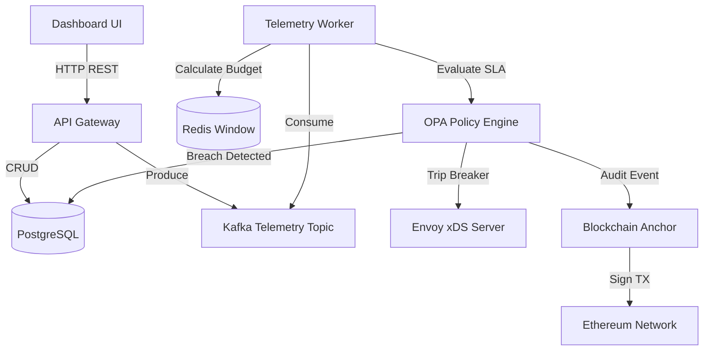

# Distributed Resilience Control Plane (DRCP)

[](https://go.dev/)
[](https://www.docker.com/)
[](https://render.com/)
[](https://opensource.org/licenses/MIT)

**Live Demo:** [https://drcp-dashboard.onrender.com](https://drcp-dashboard.onrender.com)

A production-grade, distributed control plane that enforces **Service Level Agreements (SLAs)** across microservice architectures through real-time telemetry ingestion, automated circuit breaking, and immutable blockchain audit trails.

---

## Overview

In modern, highly scaled microservice architectures, an outage in one downstream service can quickly cascade and take down the entire system. **DRCP** acts as the central brain to prevent this. 

It allows platform engineers to define strict SLA contracts (e.g., *Service A must maintain P99 latency < 200ms and Error Rate < 5%*). DRCP continuously monitors live telemetry, calculates error budgets in real-time, and automatically triggers Envoy Proxy circuit breakers to shed load the moment an SLA is breached. To ensure accountability, every breach is securely anchored as an immutable transaction on the Ethereum blockchain.

---

## Core Features

1. **Service Registry**: A centralized hub to register, discover, and monitor the health of all microservices within the mesh.
2. **Dynamic SLA Contracts**: Define latency and error-rate thresholds dynamically using Open Policy Agent (OPA) Rego policies.
3. **Real-Time Telemetry Pipeline**: Ingest high-throughput metrics via Apache Kafka and compute sliding-window error budgets using Redis.
4. **Automated Circuit Breaking**: Seamlessly integrates with Envoy Proxy via the xDS gRPC API to automatically trip circuit breakers and route traffic away from failing nodes.
5. **Blockchain Audit Trail**: Guarantees trust and transparency by anchoring incident reports (breaches) as immutable transactions on the Ethereum blockchain.
6. **Premium Dashboard**: A beautifully designed, high-performance vanilla JS Single Page Application (SPA) utilizing modern glassmorphism design, real-time data binding, and an intuitive user experience.

---

## Architecture Breakdown

The system is highly decoupled and composed of several specialized microservices communicating asynchronously:



### 1. The API Gateway & Registry
The main Go server provides REST endpoints for the frontend dashboard to manage services and contracts. It stores configuration state persistently in PostgreSQL (or SQLite for zero-config deployments).

### 2. Telemetry Ingestion & Budgeting
Services emit telemetry (requests, errors, latency). This data is ingested via an API endpoint and placed onto a **Kafka** topic. A dedicated background worker consumes these events, updating a sliding-window counter stored in **Redis** to track real-time error rates over the last 60 seconds.

### 3. Policy Evaluation (OPA)
For every telemetry window, the worker queries the **Open Policy Agent (OPA)**. OPA evaluates the current telemetry data against the JSON/Rego SLA contracts defined by the user. If an SLA is violated, OPA returns a breach decision.

### 4. Circuit Breaking (Envoy xDS)
When a breach occurs, the control plane immediately updates the configuration state of the Envoy Proxies handling traffic. It pushes an updated snapshot via the **xDS gRPC protocol**, opening the circuit breaker to prevent cascading failures.

### 5. Immutable Auditing (Ethereum)
Simultaneously, the incident is forwarded to the anchoring service. The service signs an Ethereum transaction containing the incident hash and SLA details, storing the breach permanently on-chain for vendor accountability.

---

## Tech Stack

| Layer | Technologies Used |
|---|---|
| **Language** | Go (Golang) 1.25 |
| **API Framework** | Gin Web Framework |
| **Database** | PostgreSQL (GORM), SQLite (Fallback) |
| **Messaging** | Apache Kafka (Sarama) |
| **Cache & State** | Redis |
| **Policy Engine** | Open Policy Agent (OPA) |
| **Service Mesh** | Envoy Proxy (xDS API) |
| **Blockchain** | Ethereum (go-ethereum) |
| **Frontend** | Vanilla HTML/CSS/JS, Lucide Icons, Plus Jakarta Sans |
| **Deployment** | Docker, Render |

---

## Quick Start (Local Run)

### Prerequisites
- Go 1.25+
- Docker & Docker Compose

### 1. Start the Infrastructure
Spin up PostgreSQL, Redis, and Kafka:
```bash
docker compose up -d
```

### 2. Run the Control Plane
The application is configured to fall back to an embedded SQLite database if PostgreSQL is not available, meaning you can also run it instantly without Docker.
```bash
go run ./cmd/api
```

### 3. Access the Dashboard
Open your browser and navigate to:
**[http://localhost:8080](http://localhost:8080)**

---

## API Endpoints

| Method | Endpoint | Description |
|---|---|---|
| `GET` | `/health` | Health check |
| `GET` | `/api/v1/services` | List all registered services |
| `POST` | `/api/v1/services` | Register a new service |
| `GET` | `/api/v1/services/:id` | Get details of a specific service |
| `POST` | `/api/v1/services/:id/contracts` | Create an SLA contract for a service |
| `GET` | `/api/v1/contracts` | List all active SLA contracts |
| `GET` | `/api/v1/incidents` | List all incidents and breaches |
| `POST` | `/api/v1/telemetry` | Ingest raw telemetry data |

---

## Project Structure

```
sentinelmesh/
├── cmd/
│   ├── api/          # REST API server (main entry point)
│   ├── worker/       # Kafka consumer + OPA evaluation worker
│   ├── xds/          # Envoy xDS gRPC control plane
│   └── anchor/       # Blockchain anchoring microservice
├── internal/
│   ├── registry/     # Service & SLA CRUD logic
│   ├── telemetry/    # Telemetry ingestion handler
│   ├── budget/       # Redis sliding-window calculator
│   ├── policy/       # OPA evaluation engine
│   ├── xds/          # Envoy snapshot builder
│   └── anchor/       # Ethereum transaction signer
├── pkg/
│   ├── db/           # Database connections (Postgres/SQLite)
│   ├── kafka/        # Kafka producer & consumer wrappers
│   ├── cache/        # Redis client
│   └── logger/       # Zap structured logging
├── web/              # Frontend dashboard SPA (HTML, CSS, JS)
├── contracts/        # Solidity smart contracts
├── Dockerfile        # Multi-stage production build
└── docker-compose.yml# Local infrastructure
```

---

<div align="center">
  <p>Built by <b>Prachi01Yadav</b></p>
</div>
